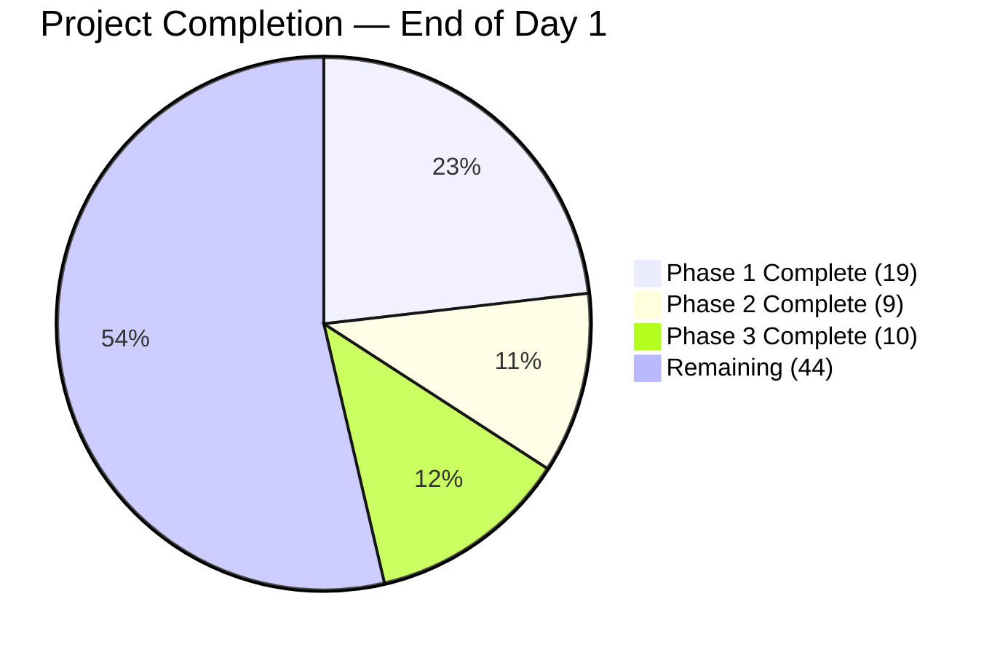
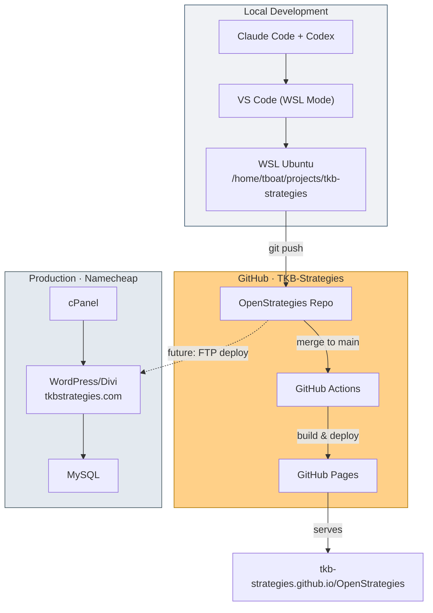
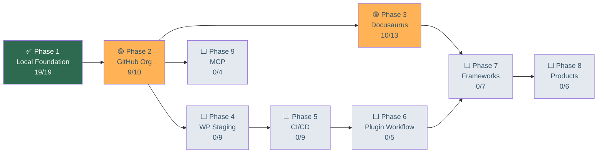

# Day 1 — From Empty Folder to Live Site

**March 22, 2026 · TKB Strategies · OpenStrategies**

## 1. Executive Summary

Today established the entire foundation of the TKB Strategies open consulting company model. Starting from an empty folder in WSL, we initialized a Git repository with governance documents, AI context files, and security policies in Phase 1. We then created the GitHub Organization `TKB-Strategies` with the `OpenStrategies` repo and configured branch protection, secrets, and GitHub Pages in Phase 2, before designing and deploying a premium editorial Docusaurus site with a cinematic impact-report aesthetic in Phase 3. The site is now live at https://tkb-strategies.github.io/OpenStrategies/, and overall project completion moved from 0% to 46% in a single day.

## 2. Today's Journey — Timeline

```mermaid
gantt
    title Day 1 — Session Timeline
    dateFormat HH:mm
    axisFormat %H:%M

    section Session 1
    Phase 1 - Local repo init           :s1a, 00:00, 90min
    Directory structure & CLAUDE.md     :s1b, after s1a, 60min
    Governance docs & .gitignore        :s1c, after s1b, 45min
    Initial commit on main              :milestone, s1m, after s1c, 0min

    section Session 2
    Project roadmap (82 tasks)          :s2a, after s1m, 60min
    Operations journal template         :s2b, after s2a, 30min
    Docusaurus added to plan            :s2c, after s2b, 30min
    Setup scripts created               :s2d, after s2c, 30min

    section Session 3
    GitHub Org created                  :s3a, after s2d, 30min
    Remote connected & pushed           :s3b, after s3a, 20min
    Branch protection & secrets         :s3c, after s3b, 15min
    Repo migrated to WSL-native         :s3d, after s3c, 30min
    Docusaurus scaffolded               :s3e, after s3d, 30min
    Editorial design implemented        :s3f, after s3e, 90min
    GitHub Actions deploy workflow      :s3g, after s3f, 15min
    Site live on GitHub Pages           :milestone, s3m, after s3g, 0min
    README redesigned (Medplum-style)   :s3h, after s3m, 20min
```

## 3. Phase Progress Map

## 4. Architecture Established

## 5. Decisions Log

| # | Decision | Rationale | Impact |
|---:|---|---|---|
| 1 | WSL-native working tree | NTFS mount caused `EPERM` errors | Eliminated permission issues and improved Git/npm reliability |
| 2 | Git metadata in Linux filesystem | WSL cannot reliably perform all Git filesystem operations on NTFS mounts | `.git` pointer at repo root and durable Git operations from Linux storage |
| 3 | `CLAUDE.md` at every directory level | Claude Code reads the nearest `CLAUDE.md` | AI-assisted development has correct context from day one |
| 4 | GitHub repo scoped to custom work only | Core WordPress files remain managed by hosting | Cleaner repo boundaries and deployment aimed only at custom paths |
| 5 | Docusaurus on GitHub Pages | Free hosting, markdown-native workflow, builds directly from repo content | Frameworks and methodology can publish automatically on merge to `main` |
| 6 | DM Serif Display + Lato typography | Editorial contrast and Lato alignment with the production site | The Docusaurus site feels like the publication arm of TKB Strategies |
| 7 | CSS-only visual design | Fast loads, no image licensing overhead, works cleanly within GitHub Pages | Premium feel delivered through typography, gradients, and composition |
| 8 | `.gitattributes` with LF enforcement | Line-ending drift appeared after WSL migration | Prevents CRLF/LF issues across future cross-platform work |

## 6. Dependency Map — Current State

## 7. Commits Merged to Main

| Hash | Message | Phase |
|---|---|---|
| `9ae21df` | Initial repository structure for TKB Strategies open consulting model | P1 |
| `2cba379` | Remove failed Git bootstrap artifact | P1 |
| `69feedb` | Add project roadmap and restructure operations journal for daily closeout tracking | P1 |
| `ea07605` | Update CLAUDE.md with project tracking and Docusaurus context | P1 / P3 prep |
| `1680ab6` | Add GitHub Organization profile README for public-facing org page | P2 |
| `983d750` | Add setup scripts for GitHub remote (Phase 2) and Docusaurus scaffold (Phase 3) | P2 / P3 prep |
| `3d0a4b6` | Add Docusaurus AI context and README ahead of Phase 3 scaffold | P3 |
| `e7ab1ef` | Update .gitignore with Docusaurus exclusions (P3.8) | P3 |
| `3d9cfdd` | Daily closeout — Session 2: tracking infrastructure, Docusaurus planning, Phase 2 prep | Journal |
| `f880b25` | Update setup-remote.sh to reflect actual GitHub org and repo (TKB-Strategies/OpenStrategies) | P2 |
| `a0865d3` | Add .gitattributes to enforce LF line endings across environments | P1 / P2 |
| `ae3a656` | Scaffold Docusaurus site in Linux-native workspace (P3.1) | P3 |
| `3efd013` | Merge pull request #1 from TKB-Strategies/feature/docusaurus-scaffold | P3 |
| `d7f840c` | Replace default Docusaurus with TKB Strategies editorial design (P3.2-P3.7) | P3 |
| `85f6437` | Merge pull request #2 from TKB-Strategies/feature/docusaurus-editorial-design | P3 |
| `5dc52c2` | Add GitHub Actions workflow for Docusaurus deploy to GitHub Pages (P3.9) | P3 / P5 foundation |
| `ad14073` | Merge pull request #3 from TKB-Strategies/feature/deploy-docs-workflow | P3 |
| `dbc1b4a` | Redesign README with structured sections, badges, folder tree, and contribution guidelines | P2 / repo presentation |

## 8. Open Items

| ID | Task | Priority | Notes |
|---|---|---|---|
| `P2.7` | Verify org profile README renders | Low | May need a separate `.github` repository |
| `P3.6` | Update `site/CLAUDE.md` | Medium | Align with the final Docusaurus configuration |
| `P3.12` | Add Docusaurus to `STACK.md` | Medium | Document site architecture and deploy pipeline |
| `P3.13` | Evaluate custom domain | Low | `open.tkbstrategies.com` or `docs.tkbstrategies.com` |
| `P2.5` | Tighten branch protection | Medium | Disable admin bypass before Phase 5 |

## 9. Day 1 Velocity

From a standing start, this project moved from 0% to 46% complete in a single day. More importantly, the open consulting model is no longer an internal concept or a private operating theory; it is now publicly visible, technically grounded, and publishable. The foundation built today supports everything that comes next: framework content, digital products, plugin development, and the WordPress staging environment.

The methodology doesn't have to stay locked behind proposals. Today we proved that.
