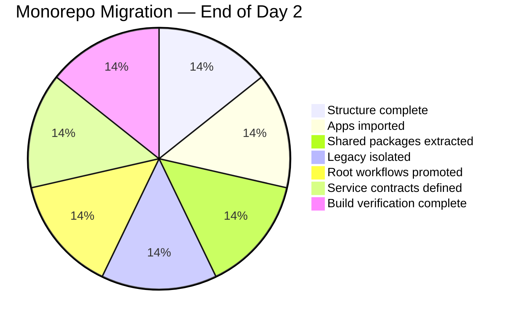
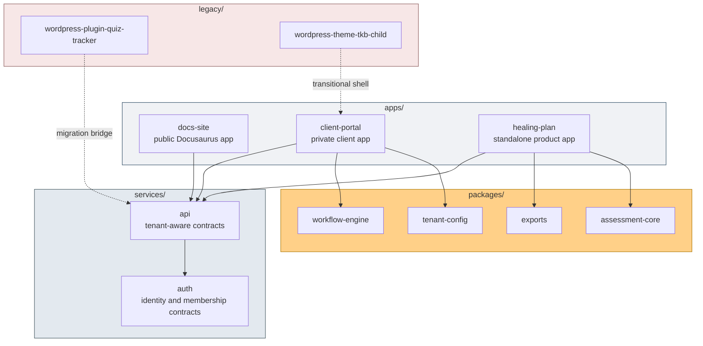
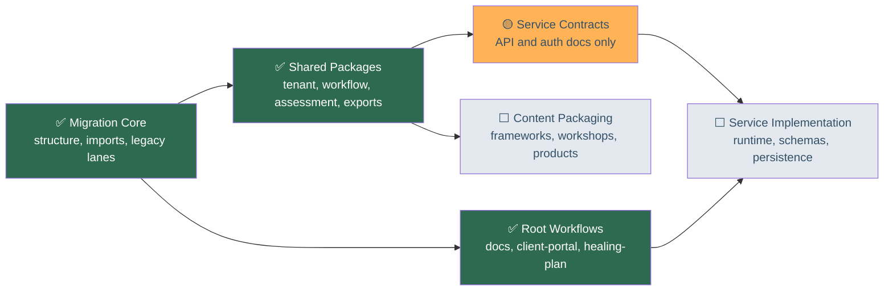

# Day 2 — From Public Repo to Working Monorepo

**March 29, 2026 · TKB Strategies · OpenStrategies**

## 1. Executive Summary

Today completed the repository's first real architectural migration. What began as a public documentation-first repository with placeholder directories is now a working monorepo with deployable apps under `apps/`, reusable logic under `packages/`, tenant-aware service contracts under `services/`, and legacy WordPress bridges isolated under `legacy/`. The migration also pulled `client-template` and `healing-plan` into the repo, extracted the first shared packages, promoted root-level deploy workflows, and verified that all three active app lanes build from their monorepo locations.

## 2. Today's Journey — Timeline

```mermaid
gantt
    title Day 2 — Monorepo Migration Timeline
    dateFormat HH:mm
    axisFormat %H:%M

    section Structure
    Migration plan drafted                :s1a, 00:00, 45min
    Monorepo skeleton created             :s1b, after s1a, 45min
    Docs app moved to apps/docs-site      :s1c, after s1b, 45min

    section App Import
    client-portal imported                :s2a, after s1c, 45min
    healing-plan imported                 :s2b, after s2a, 30min
    Root workflows promoted               :s2c, after s2b, 45min
    Nested workflows removed              :s2d, after s2c, 20min

    section Package Extraction
    tenant-config extracted               :s3a, after s2d, 45min
    workflow-engine extracted             :s3b, after s3a, 30min
    assessment-core extracted             :s3c, after s3b, 30min
    exports extracted                     :s3d, after s3c, 20min

    section Platform Boundaries
    WordPress moved to legacy             :s4a, after s3d, 20min
    Services contracts documented         :s4b, after s4a, 45min
    API contract docs added               :s4c, after s4b, 30min
    Auth contract docs added              :s4d, after s4c, 30min

    section Verification
    client-portal build verified          :s5a, after s4d, 20min
    healing-plan build verified           :s5b, after s5a, 20min
    Migration closeout documented         :milestone, s5m, after s5b, 0min
```

## 3. Phase Progress Map

## 4. Architecture Established

## 5. Decisions Log

| # | Decision | Rationale | Impact |
|---:|---|---|---|
| 1 | Make the monorepo the source of truth | Package logic and app surfaces were already starting to drift across repos and folders | Future standalone repos can publish outward from monorepo subpaths instead of being co-developed manually |
| 2 | Organize around `apps/`, `packages/`, `services/`, and `legacy/` | Business-category folders like `plugins/` and `themes/` were poor engineering boundaries | The repo now reflects deploy surfaces, reusable logic, future backend lanes, and transitional bridges distinctly |
| 3 | Treat `client-template` as `apps/client-portal` | It functions as a tenant-facing delivery surface, not just a loose template | Private delivery work now has a real home inside the monorepo |
| 4 | Treat `healing-plan` as an app plus extractable domain logic | It was both a shipped product surface and a container for reusable assessment/export logic | Product-specific UI remains in `apps/healing-plan` while reusable behavior moved into packages |
| 5 | Promote deploy workflows to the repo root | App-local workflows no longer matched the monorepo ownership model | CI/CD responsibility is now aligned with the actual repository layout |
| 6 | Move WordPress work under `legacy/` | WordPress remains operationally relevant but should not define the future platform center | The SaaS transition now has a visible boundary between transitional and future-core code |
| 7 | Define service contracts before service code | The repo needed backend boundaries without prematurely locking into a runtime | `services/api` and `services/auth` now document the first platform assumptions without adding premature implementation overhead |
| 8 | Close migration only after build verification | A directory migration is not complete until the moved apps still work where they live | All three active app lanes are now verified from their monorepo locations |

## 6. Dependency Map — Current State

## 7. Commits Merged to Main

| Hash | Message | Area |
|---|---|---|
| `fe1997f` | Restructure repo into monorepo skeleton and move docs app into apps/docs-site | Structure |
| `555dd13` | Import client-portal and healing-plan apps into monorepo | App import |
| `f9ba0c0` | Extract tenant-config, assessment-core, and exports packages | Package extraction |
| `5ee5ab2` | Track client-portal app and exports package in monorepo | Repo hygiene |
| `33888d5` | Extract workflow-engine package from client-portal navigation | Package extraction |
| `b3bcc9e` | Promote client-portal and healing-plan deploy workflows to root | CI/CD |
| `e04a840` | Normalize client-portal to npm for monorepo workflows | CI/CD |
| `9004f91` | Define initial API and auth service contracts | Services |
| `c95512a` | Define initial tenant, assessment, and export API contracts | Services |
| `bc37c53` | Define initial membership, role, and request context auth contracts | Services |
| `c682964` | Move WordPress plugin and theme placeholders into legacy | Legacy |
| `1b9ec0a` | Remove nested app workflows after root workflow promotion | Cleanup |
| `9e2c228` | Close out monorepo migration and update roadmap status | Closeout |

## 8. Open Items

| ID | Task | Priority | Notes |
|---|---|---|---|
| `M1` | Convert framework source areas into real packages | High | `frameworks/` still exists as a content-first root rather than package-owned content |
| `M2` | Convert workshop, presentation, and product placeholders into content packages | High | These areas still use the pre-monorepo top-level layout |
| `M3` | Decide the first implementation lane after migration | Medium | Options are service schemas, service scaffolding, or shared UI/design-token extraction |
| `M4` | Bring in any active Google Apps Script assets under `legacy/` | Medium | Only needed if those scripts still support production operations |
| `M5` | Refresh the older roadmap against the new monorepo model | Medium | `docs/ROADMAP.md` now includes a status note but still reflects the earlier sequencing |

## 9. Day 2 Velocity

This was not just a documentation pass or a directory cleanup. The repository crossed from a public-site project with future intentions into a working monorepo with verified app lanes, extracted shared packages, explicit legacy boundaries, and contract-first service lanes. The next work should be narrower and more deliberate: package the remaining content roots, then choose one true implementation lane instead of continuing broad structural changes.

The architecture is no longer hypothetical. The repo now matches it.
